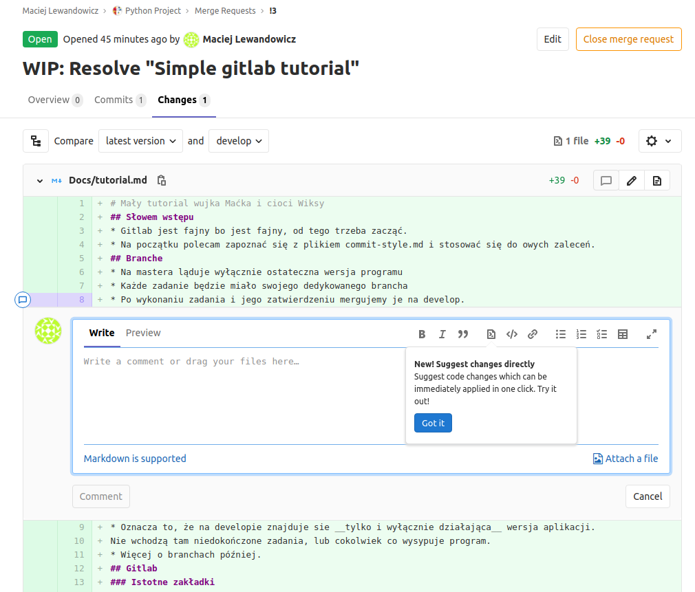
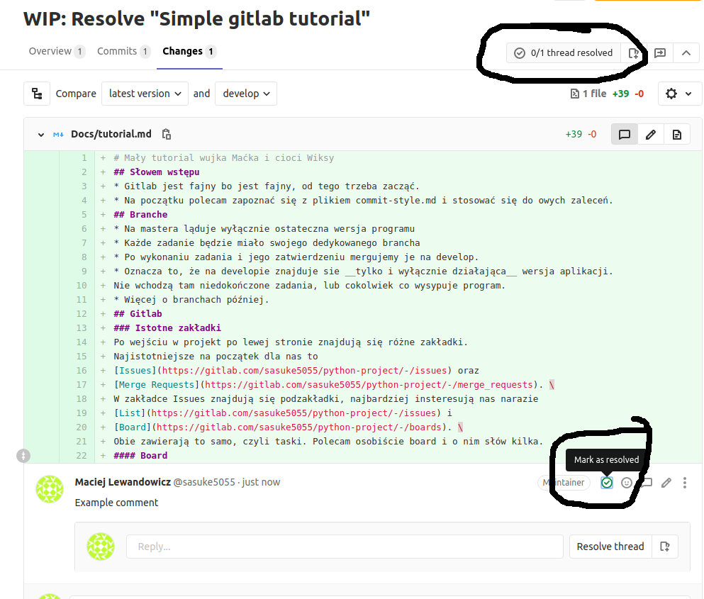
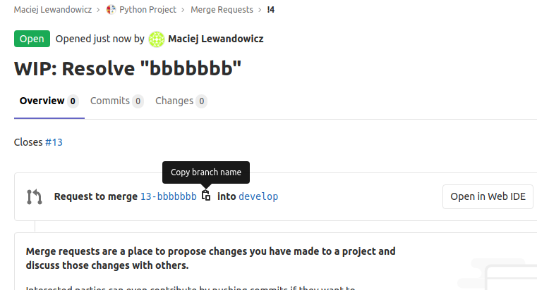

# Mały tutorial wujka Maćka i cioci Wiksy
## 1. Słowem wstępu
* Gitlab jest fajny bo jest fajny, od tego trzeba zacząć.
* Na początku polecam zapoznać się z plikiem [commit-style.md](commit-style.md).
## 2. Branche
* Na mastera ląduje wyłącznie ostateczna wersja programu
* Każde zadanie będzie miało swojego dedykowanego brancha
* Po wykonaniu zadania i jego zatwierdzeniu mergujemy je na develop.
* Oznacza to, że na developie znajduje sie __tylko i wyłącznie działająca__ wersja aplikacji. 
Nie wchodzą tam niedokończone zadania, lub cokolwiek co wysypuje program.
* Więcej o branchach później. 
## 3. Gitlab
### 3.1. Istotne zakładki
Po wejściu w projekt po lewej stronie znajdują się różne zakładki. 
Najistotniejsze na początek dla nas to 
[Issues](https://gitlab.com/sasuke5055/python-project/-/issues) oraz 
[Merge Requests](https://gitlab.com/sasuke5055/python-project/-/merge_requests). \
W zakładce Issues znajdują się podzakładki, najbardziej insteresują nas narazie
[List](https://gitlab.com/sasuke5055/python-project/-/issues) i 
[Boards](https://gitlab.com/sasuke5055/python-project/-/boards). \
Obie zawierają to samo, czyli taski. Polecam osobiście board i o nim słów kilka.
#### 3.1.1. Boards
Na obecną chwilę znajduje się tutaj 5 kolumn - Open, To Do, Doing, To Review, oraz Closed. 
Znajduje się tu już kilka tasków, czyli płytek w kolumnach. Płytki możemy przeciągać i przekładać w inne kolumny
w zależności od tego na jakim etapie są konkretne taski. 
* W kolumnie __Open__ znadują się bardzo ogóle rzeczy, które są do zrobienia. 
* W kolumnie __To Do__ znajdują się konkretne zadania do wykonania
* W kolumnie __Doing__ są taski nad ktorym ktos obecnie pracuje
* W kolumnie __To Review__ są ukończone taski, które czekają na sprawdzenie przez innych
* W kolumnie __Closed__ taski zmergowane na developa, czyli dokonczone, sprawdzone i poprawione. 

Zadania dodajemy do __To Do__ (i tylko tam) przyciskiem plusik. Następnie po wpisaniu nazwy klikamy __Submit issue__.  
Pojawia się po prawej stronie panel z ustawieniami naszego nowego zadania. Ustawiamy tam do kogo jest przypisane,
oraz Labele.
Automatycznie ustawia się label __To Do__ ponieważ w takiej kolumnie dodaliśmy naszego taska. 
Ustawiamy zatem __Frontend__/__Backend__ i jesteśmy zrobieni.
Więcej o tworzeniu samego taska potem. 
#### 3.1.2. Merge Request
Tutaj znajdują się merge requesty. Nie tworzymy ich z tego panelu, ale o tym więcej przy pracy z taskiem. \
Zadania są nazwane "WIP: Resolve \<nazwa zadania>" lub samo "Resolve \<nazwa zadania>" gdy task został ukończony. \
Po kliknięci w merge request widzimy ogólny panel tego requesta (a właściwie taska w trakcie pracy, o tym potem). \

W celu przejrzenia zmian i komentowania kodu wchodzimy w __Changes__ zaraz obok _Overview_ i _Commits_.
Tutaj możemy obserwować zmiany i komentować dowolną linię kodu.

Jako developer po pojawieniu się komentarza, powinniśmy poprawić kod zgodnie z uwagami, wtedy osoba komentująca zaznacza __Mark as resolved__ 
przy komentarzu. Bez tego możliwość mergowania jest zablokowana. U góry pokazuje się ilość wątków do wyjaśnienia.

Więcej o requestach potem.
## 3. Tworzenie lokalnego repozytorium
Na początku musimy stworzyć lokalne repo z naszym projektem. W gitlabie wchodzimy w __Project overview__,
 klikamy niebieski przycisk __Clone__ i wybierany _Https_, kopiujemy i lądujemy w terminalu. 
 Dla ubuntu wpisujemy po prostu
 ```
    ~/$ git clone <skopiowany adres https>
```
W tym momencie teoretycznie powinno wszystko grać i lokalne repo powinno sie utworzyć. 
Da się to zrobić przez nasze środowisko, co kto lubi.
Podstawowe komendy:
```
    ~/$ git pull origin <nazwa brancha>
    ~/$ git add .
    ~/$ git commit 
    ~/$ git checkout <nazwa brancha>                #gdy branch istnieje
    ~/$ git checkout -b <nazwa brancha>             #gdy tworzymy dopiero brancha
    ~/$ git push origin <nazwa brancha>
```
## 4. Praca z taskami
### 4.1. Setup taska
W końcu do sedna. Opiszę krótko (xD) jak wygląda praca z taskami, co zrobić żeby nie utrudniać sobie i innym życia.
* Wchodzimy w Issues/Boards
* W __To Do__ klikamy __+__ i tworzymy nowe zadanie. 
* Przypisujemy bohatera jeśli owy jest już znany i nadajemy odpowiednie __Labele__.
* Klikamy w __wyboldowaną__ nazwę zadania.
* Pojawia nam się takie okienko, klikamy __Create merge request__ 
(z paska można rozwinąć opcje, zostawiamy _Create merge request and branch_ !!). 
Tym samym tworzymy również dedykowanego dla tego zadania brancha.

* Nasz task pojawia się w zakładce [Merge Requests](https://gitlab.com/sasuke5055/python-project/-/merge_requests) 
z dopiskiem WIP co oznacza po prostu Work In Progress.
* Od teraz pracując w naszym środowisku musimy u siebie stworzyć nowego brancha o tej samej nazwie, 
a następnie commitować na niego. Polecam ten przycisk xD

* Przy commitowaniu stosujemy się do odpowiedniego [stylu](commit-style.md).
* Zaczynając pracę przesuwamy płytkę z naszym zadaniem do kolumny __Doing__ w zakładce _Boards_
### 4.2 Mergowanie taska
Gdy uznamy że praca nad zadaniem jest skończona należy podjąć działania w celu zmergowania naszego brancha na developa.
* Wchodzimy w [Merge Requests](https://gitlab.com/sasuke5055/python-project/-/merge_requests), otwieramy naszego taska.
* Klikamy przycisk __Resolve WIP status__. Od tego momentu znika dopisek 'WIP:' przy nazwie Merge Requestów.
* Przesuwamy płytkę naszego taska do kolumny __To Review__
* Tutaj czekamy aż ktoś przejrzy nasz kod i wypisze ewentualne rzeczy do poprawienia. Wymagane jest, 
aby był to ktoś inny niz piszący kod xD, a jeszcze lepszą to, żeby backa sprawdzała osoba z fronta i odwrotnie 
(szczególnie że każdy z nas musi ogarnąć wszystko), najcudowniej będzie gdy każdego taska sprawdzą 2 osoby. 
### 4.3 Code review
Sprawdzający kod ma za zadanie wyłapać bugi, rzeczy które można poprawić itd. 
* Wchodzimy w [Merge Requests](https://gitlab.com/sasuke5055/python-project/-/merge_requests) i otwieramy taska.
* Dalej otwieramy __Changes__ i komentujemy kod jak w [3.1.2]. Autor kodu ma za zadanie kod poprawić, 
lub uzasadnić swoje rozwiazanie.
* Gdy osoba rewidująca kod uzna że jest wszystko ok, udaje się do zakładki __Overview__ i daje łapkę w górę. 
### 4.4 Mergowanie c.d.
Gdy otrzymamy łapkę w górę od wszystkich osób sprawdzających możemy mergować naszego brancha na developa.
* Klikamy __Merge__ zaznaczając _Delete source branch_ oraz _Squash commits_ (jeśli ten drugi się pojawi) i gotowe.
* W tym momencie płytka z naszym taskiem powinna sama przenieść się do kolumny __Closed__, 
a nasz request wyląduje w zakładce __Merged__. 
## 5 Zadanie domowe
* Zrób taska o nazwie "Learn gitlab \<twoje imie>"
* Postępuj jak w punktach powyżej
* W swoim środowisku pobierz brancha twojego taska
* Stwórz plik \<twojeimie>.py w folderze Docs
* Przesuwaj wszystkie płytki zgodnie z instrukcją
* Zakomentuj swojego merge requesta
* Resolve wszystkie wątki
* Zmerguj na developa :)
## 6 Podsumowanie
Może to wszystko wydawać się lekko zagmatwane, a np tworzenie merge requestów przed tym jak w ogóle powstanie linia 
kodu sprzeczne, ale po prostu w taki sposób (ale nie tylko taki) pracuje się na gitlabie z projektami, 
myślę że warto się tego nauczyć. W razie wątpliwości i pytań śmiało, mogłem coś pomylić, zamieszać, sam ogarniam to 
ledwo kilka godzin.

